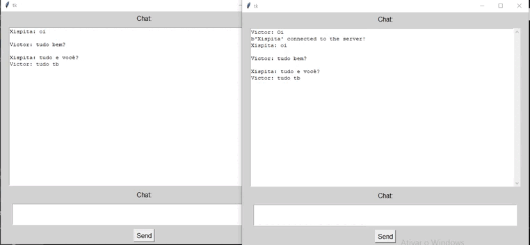

# CHAT
Chat feito em Python utilizando socket,thread e tkinter para fazer a interface

## Tecnologia utilizada 
<ul>
  <li>Python</li>
</ul>

## Bibliotecas utilizadas
<ul>
  <li>Socket</li>
  <li>Thread</li>
  <li>Tkinter</li>
</ul>

## Visualização

## Como utilizar

Abrir um terminal navegar ate a pasta do projeto e executar : python server.py para iniciar o servidor, depois abra outros terminais navegue até a pagina do projeto e digite : python client.py 

